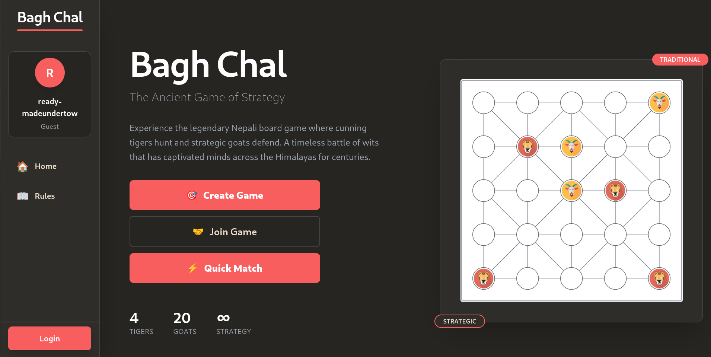

akd;fkaj;flja;fkjaf
fadf;lkajdf
adf;akldf

# Bagh Chal

Bagh Chal is an ancient Nepali strategy game of tigers and goats — now playable online, in real-time, for free.

Four tigers hunt. Twenty goats surround. Someone always loses.

## [**Play now →**](https://bagh-chal.onrender.com)

---

Tigers capture goats by jumping over them. Goats win by surrounding all four tigers completely. The two sides play nothing alike: different rules, different goals, different instincts required.

**Features**

- Real-time multiplayer over WebSocket
- No account required — share a link and play
- Quick match, private rooms, or join by ID
- Works on mobile

**Links**

- [How to play](https://bagh-chal.onrender.com/rules)
- [Local setup & contributing](CONTRIBUTING.md)
- [Open an issue](https://github.com/Tailung42/baghchal/issues)

---